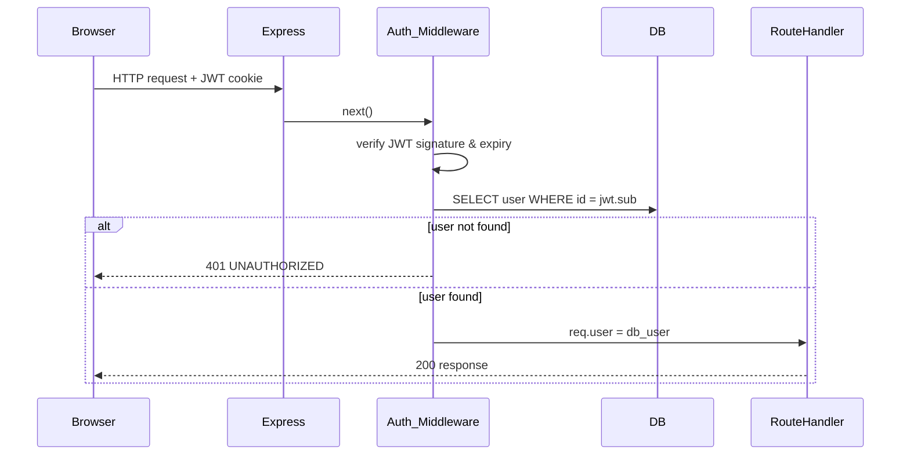



UI is built with shadcn/ui components and Tailwind theme tokens as described in the `ui.md` steering file. Forms use React Hook Form with the Zod resolver; validation schemas come from `packages/shared` and are never duplicated in the frontend. All visible text uses i18next translation keys from the `common`, `auth`, or `errors` namespaces.# Design Document — Foundation & Authentication

## Overview

This document describes the technical design for the `foundation-auth` feature: setting up the monorepo structure, local development infrastructure, database schema, and the full authentication and authorisation surface of the Manual QA Trainer application.

The scope covers:

- pnpm workspace scaffold with four packages (`apps/web`, `apps/api`, `apps/e2e`, `packages/shared`)
- Docker-based PostgreSQL for local development and testing
- Prisma schema and initial migration for the `users` table
- User registration, login, logout, and current-user endpoints
- JWT stored in httpOnly cookies; server-side Auth_Middleware and admin-role guard
- Admin seed script
- Unified API error response format
- Per-IP rate limiting on auth endpoints
- React web pages: register, login, home placeholder, admin placeholder, not-authorised
- Client-side Role_Guard component and session restoration

Out of scope: scenarios, task submissions, AI review, statistics.

---

## Architecture

The system is a pnpm monorepo with three runnable apps and one shared library package.

```mermaid
graph TD
  subgraph Browser
    WEB["apps/web (React + Vite)"]
  end

  subgraph Node
    API["apps/api (Express)"]
  end

  subgraph Data
    PG[(PostgreSQL)]
  end

  WEB -->|HTTP /api/* (proxied in dev)| API
  API -->|Prisma ORM| PG
  SHARED["packages/shared (Zod schemas, types, constants)"]
  WEB -->|import types/schemas| SHARED
  API -->|import schemas/constants| SHARED
```

### Request Flow — Authenticated Endpoint



### Local Development Startup

```
pnpm dev
  └─ docker compose up -d          # postgres:dev + postgres:test
  └─ concurrently
       ├─ apps/api  → tsx watch     # hot reload, port 3000
       └─ apps/web  → vite         # hot reload, port 5173
              └─ /api → proxy → :3000
```

---

## Components and Interfaces

### `packages/shared`

All Zod schemas and TypeScript types shared between client and server.

```
packages/shared/
├── src/
│   ├── schemas/
│   │   ├── auth.ts          # registerSchema, loginSchema, publicUserSchema
│   │   └── error.ts         # errorResponseSchema, errorDetailSchema
│   ├── constants/
│   │   ├── errorCodes.ts    # ERROR_CODE enum / const object
│   │   ├── validationKeys.ts# VALIDATION_KEY const object (EMAIL_INVALID, PASSWORD_TOO_SHORT, PASSWORD_TOO_LONG, FIELD_REQUIRED)
│   │   └── roles.ts         # ROLE enum / const object
│   └── index.ts             # barrel re-exports
└── package.json
```

Key exported types (inferred from Zod):

| Export | Shape |
|--------|-------|
| `RegisterInput` | `{ email: string, password: string }` |
| `LoginInput` | `{ email: string, password: string }` |
| `PublicUser` | `{ id: string, email: string, role: 'user'\|'admin', createdAt: string }` |
| `ErrorResponse` | `{ error: { code: string, message: string, details?: ErrorDetail[] } }` |
| `ErrorDetail` | `{ field: string, message: string }` |
| `ERROR_CODE` | const object with all eight error code strings |
| `VALIDATION_KEY` | const object `{ EMAIL_INVALID, PASSWORD_TOO_SHORT, PASSWORD_TOO_LONG, FIELD_REQUIRED }` |
| `ROLE` | const object `{ USER: 'user', ADMIN: 'admin' }` |

Validation rules baked into shared schemas:

- `email`: trimmed and lowercased first via `.transform()`, then piped into `z.email({ error: 'EMAIL_INVALID' })`, so normalisation always runs before format validation.
- `password`: `z.string().min(8, { error: 'PASSWORD_TOO_SHORT' })` + `.check()` with a raw string issue code (`'PASSWORD_TOO_LONG'`) for the byte-length guard using `new TextEncoder().encode(pw).length > 72`.

> **Note:** `packages/shared` must not use Node.js-only APIs (like `Buffer`) because `apps/web` imports it. Use the Web-standard `TextEncoder` API instead.

### `apps/api`

```
apps/api/
├── prisma.config.ts         # Prisma 7 config: schema path, migrations path, seed command, datasource url
├── prisma/
│   ├── schema.prisma
│   └── migrations/
├── src/
│   ├── index.ts             # app entry — validates env, starts server
│   ├── app.ts               # Express app factory. Accepts optional AppConfig: rateLimiting can be false (disable) or { max, windowMs } (override). Signature: createApp(config?: AppConfig): Express
│   ├── config.ts            # typed env config (JWT_SECRET, JWT_EXPIRES_IN, etc.)
│   ├── middleware/
│   │   ├── auth.ts          # requireAuth — verifies JWT, loads user from DB
│   │   ├── requireAdmin.ts  # requireAdmin — checks req.user.role === 'admin'
│   │   ├── errorHandler.ts  # global error handler → ErrorResponse shape
│   │   └── rateLimiter.ts   # per-IP limiter factory
│   ├── routes/
│   │   ├── auth.ts          # POST register, login, logout; GET me
│   │   └── admin.ts         # GET /api/admin/ping
│   ├── services/
│   │   └── auth.ts          # hashPassword, comparePassword, signToken, verifyToken
│   └── db.ts                # Prisma client singleton — instantiates PrismaClient with the PrismaPg driver adapter
├── scripts/
│   └── seed.ts              # Admin seed script
└── package.json
```

#### Middleware contract

**`requireAuth`**

```ts
// Attaches verified DB user to the request.
// Extracts JWT from the httpOnly cookie, verifies signature and expiry,
// then uses jwt.sub to load the user from the DB. The role comes from the
// DB record — never from the JWT payload.
// Returns 401 UNAUTHORIZED if JWT is missing, invalid, expired,
// or the user ID no longer exists in the DB.
(req: Request, res: Response, next: NextFunction) => void
```

The role used for all subsequent authorisation checks is taken from the DB record, not from the JWT payload.

**`requireAdmin`**

```ts
// Must be composed AFTER requireAuth.
// Returns 403 FORBIDDEN if req.user.role !== 'admin'.
(req: Request, res: Response, next: NextFunction) => void
```

**`errorHandler`**

Global Express error handler (four-argument form). Maps thrown errors and explicit `next(err)` calls to the unified `ErrorResponse` shape. Catches unhandled exceptions, logs them server-side, and returns 500 `INTERNAL_ERROR` without leaking stack traces.

**`rateLimiter`**

Factory that accepts `{ max, windowMs }` and returns an `express-rate-limit` middleware instance. Login (`POST /api/auth/login`) and registration (`POST /api/auth/register`) each get their own rate limiter instance with independent counters. Both read `RATE_LIMIT_AUTH_MAX` and `RATE_LIMIT_AUTH_WINDOW_MS` from environment variables and use the same limits.

#### Auth service functions

```ts
hashPassword(plaintext: string): Promise<string>
// bcrypt.hash with work factor read from BCRYPT_ROUNDS env variable (default 12; tests use 4)

comparePassword(plaintext: string, hash: string): Promise<boolean>
// bcrypt.compare

signToken(payload: { sub: string }): string
// jwt.sign with JWT_SECRET and JWT_EXPIRES_IN
// JWT payload contains only `sub` (the user's UUID).
// The role is never stored in the token; it is always loaded from the DB on each authenticated request.

verifyToken(token: string): { sub: string }
// jwt.verify; throws on invalid/expired
```

#### Cookie helper

```ts
setAuthCookie(res: Response, token: string): void
// Sets cookie name 'token' with:
//   httpOnly: true
//   sameSite: 'strict'
//   secure: process.env.NODE_ENV === 'production'
//   maxAge: derived from JWT_EXPIRES_IN

clearAuthCookie(res: Response): void
// Clears the 'token' cookie using the same `path`, `sameSite`, and `secure`
// attributes as `setAuthCookie` to ensure the browser removes the correct cookie.
```

#### Seed script (`scripts/seed.ts`)

Run with `pnpm --filter api seed`. Reads `ADMIN_EMAIL` and `ADMIN_PASSWORD` from environment. Validates password with the shared schema rules. Upsert-safe: if the email already exists, prints a warning with the existing user's role and exits 0.

---

#### `db.ts`

Prisma 7 requires a driver adapter. `db.ts` instantiates `PrismaClient` with the `@prisma/adapter-pg` adapter:

```ts
// apps/api/src/db.ts
import "dotenv/config";
import { PrismaPg } from "@prisma/adapter-pg";
import { PrismaClient } from "./generated/prisma/client";

const adapter = new PrismaPg({ connectionString: process.env["DATABASE_URL"]! });
export const db = new PrismaClient({ adapter });
```

Required packages in `apps/api`:
- `@prisma/adapter-pg` — Prisma driver adapter for node-postgres
- `pg` + `@types/pg` — node-postgres database driver

---

### `apps/web`

```
apps/web/
├── vite.config.ts           # Vite config: React plugin, /api proxy, @/ alias
├── src/
│   ├── main.tsx
│   ├── i18n.ts              # i18next initialisation — uk locale, common/auth/errors namespaces
│   ├── App.tsx              # Router root; wraps routes in AuthProvider
│   ├── context/
│   │   └── AuthContext.tsx  # thin read-only wrapper that exposes the ['me'] query result via context
│   ├── components/
│   │   ├── AuthLayout.tsx   # Shared authenticated layout: top bar, nav, user email, logout
│   │   ├── RoleGuard.tsx    # Redirect logic based on auth state
│   │   ├── LogoutButton.tsx
│   │   └── ui/              # shadcn/ui components (owned by the project, editable locally)
│   │       └── FormMessage.tsx  # Translates Zod validation keys via i18next errors namespace
│   ├── pages/
│   │   ├── LoginPage.tsx
│   │   ├── RegisterPage.tsx
│   │   ├── HomePage.tsx     # Placeholder — Ukrainian greeting with the user's email; email and logout live in AuthLayout
│   │   ├── AdminPage.tsx    # Placeholder — calls /api/admin/ping
│   │   └── NotAuthorizedPage.tsx
│   ├── api/
│   │   └── auth.ts          # TanStack Query hooks: useMe, useLogin, useRegister, useLogout
│   └── locales/
│       └── uk/
│           ├── common.json  # shared labels, buttons, navigation
│           ├── auth.json    # login, registration, logout copy
│           └── errors.json  # ERROR_CODE and VALIDATION_KEY translations
└── package.json
```

#### `AuthContext`

The TanStack Query cache for the `useMe` query (`['me']`) is the single source of truth for the current user. `AuthContext` (if retained) only reads the query result and exposes it via context — it holds no separate user state. Login and register mutations call `queryClient.setQueryData(['me'], returnedUser)` on success to populate the cache. Logout mutation calls `queryClient.setQueryData(['me'], null)` to clear it. This avoids double state and ensures all components reading `useMe` see the update immediately.

The `useMe` query is configured with `retry: false`. A 401 response from `GET /api/auth/me` is treated as a resolved 'no user' state (`null`) rather than an error — the query always resolves, never rejects, allowing `RoleGuard` to distinguish 'loading' (`undefined`) from 'unauthenticated' (`null`).

#### `RoleGuard`

```tsx
<RoleGuard requireAuth>           // redirects to /login if not authenticated
<RoleGuard requireAuth requireAdmin>  // redirects to /not-authorized if role !== 'admin'
```

While the initial `/api/auth/me` query is still loading, renders a full-page spinner and does not redirect.

#### Route table

| Path | Component | Guard |
|------|-----------|-------|
| `/login` | `LoginPage` | redirect to `/` if already authenticated |
| `/register` | `RegisterPage` | redirect to `/` if already authenticated |
| `/` | `HomePage` | `requireAuth` |
| `/admin` | `AdminPage` | `requireAuth` + `requireAdmin` |
| `/not-authorized` | `NotAuthorizedPage` | none |

Redirected-from path is stored in `location.state.from` so the user can be returned after login.

---

## Data Models

### Prisma schema

```prisma
// apps/api/prisma/schema.prisma

generator client {
  provider = "prisma-client"
  output   = "../src/generated/prisma"
}

datasource db {
  provider = "postgresql"
}

enum Role {
  user
  admin
}

model User {
  id           String   @id @default(uuid()) @db.Uuid
  email        String   @unique
  passwordHash String
  role         Role     @default(user)
  createdAt    DateTime @default(now()) @db.Timestamptz

  @@map("users")
}
```

```ts
// apps/api/prisma.config.ts
import "dotenv/config";
import { defineConfig, env } from "prisma/config";

export default defineConfig({
  schema: "prisma/schema.prisma",
  migrations: {
    path: "prisma/migrations",
    seed: "tsx scripts/seed.ts",
  },
  datasource: {
    url: env("DATABASE_URL"),
  },
});
```

Notes:
- `email` is stored lowercase (normalised by the shared schema transform before insert/lookup).
- `passwordHash` is never returned via any API route or included in any shared type.
- The Prisma Client is generated into `src/generated/prisma`. Import it from that path in `db.ts` and anywhere else that imports `PrismaClient`.
- `prisma.config.ts` reads the datasource URL via `env('DATABASE_URL')` from `prisma/config`. The root `test` script switches to the test database by setting `DATABASE_URL` to the value of `TEST_DATABASE_URL` before running Prisma migrations and Vitest.
- `apps/api` uses `"type": "module"` in `package.json` and `"module": "ESNext"` / `"moduleResolution": "bundler"` in `tsconfig.json` to be compatible with the ESM-first output of the `prisma-client` generator.
- `src/generated/` is added to `.gitignore`. `prisma generate` runs automatically as part of the `postinstall` script and must be run manually after any schema change before building or starting the server.

### Shared Zod schemas (API shapes)

```ts
// packages/shared/src/schemas/auth.ts
// Uses Zod v4 (current stable).

export const publicUserSchema = z.object({
  id: z.uuid(),
  email: z.email(),
  role: z.enum(['user', 'admin']),
  createdAt: z.iso.datetime(),
});

export const registerSchema = z.object({
  email: z
    .string()
    .transform((v) => v.trim().toLowerCase())
    .pipe(z.email({ error: 'EMAIL_INVALID' })),
  password: z
    .string()
    .min(8, { error: 'PASSWORD_TOO_SHORT' })
    .check((ctx) => {
      if (new TextEncoder().encode(ctx.value).length > 72) {
        ctx.issues.push({ code: 'custom', input: ctx.value, message: 'PASSWORD_TOO_LONG' });
      }
    }),
});

export const loginSchema = z.object({
  email: z
    .string()
    .transform((v) => v.trim().toLowerCase())
    .pipe(z.email({ error: 'EMAIL_INVALID' })),
  password: z.string().min(1, { error: 'FIELD_REQUIRED' }),
});
```

> **Validation key pattern:** Zod error messages are opaque keys (`EMAIL_INVALID`, `PASSWORD_TOO_SHORT`, `PASSWORD_TOO_LONG`, `FIELD_REQUIRED`). The API extracts these keys into `details[].message`. The web client translates both `ERROR_CODE` values and these validation keys to Ukrainian via i18next using the `errors` namespace (`apps/web/src/locales/uk/errors.json`).

```ts
// packages/shared/src/schemas/error.ts

export const errorDetailSchema = z.object({
  field: z.string(),
  message: z.string(),
});

export const errorResponseSchema = z.object({
  error: z.object({
    code: z.string(),
    message: z.string(),
    details: z.array(errorDetailSchema).optional(),
  }),
});
```

```ts
// packages/shared/src/constants/errorCodes.ts

export const ERROR_CODE = {
  VALIDATION_ERROR:   'VALIDATION_ERROR',
  EMAIL_TAKEN:        'EMAIL_TAKEN',
  INVALID_CREDENTIALS:'INVALID_CREDENTIALS',
  UNAUTHORIZED:       'UNAUTHORIZED',
  FORBIDDEN:          'FORBIDDEN',
  NOT_FOUND:          'NOT_FOUND',
  RATE_LIMITED:       'RATE_LIMITED',
  INTERNAL_ERROR:     'INTERNAL_ERROR',
} as const;

export type ErrorCode = typeof ERROR_CODE[keyof typeof ERROR_CODE];
```

### Environment variables (`apps/api/.env.example`)

| Variable | Required | Default | Description |
|----------|----------|---------|-------------|
| `DATABASE_URL` | ✅ | — | PostgreSQL connection string for the dev database |
| `TEST_DATABASE_URL` | ✅ | — | PostgreSQL connection string for the test database |
| `JWT_SECRET` | ✅ | — | Secret key for signing JWTs. API exits if unset. |
| `JWT_EXPIRES_IN` | ❌ | `7d` | JWT lifetime (e.g., `7d`, `24h`) |
| `NODE_ENV` | ❌ | `development` | Set to `production` to enable secure cookies |
| `PORT` | ❌ | `3000` | API listen port |
| `BCRYPT_ROUNDS` | ❌ | `12` | bcrypt work factor. Use 4 in tests for speed. |
| `RATE_LIMIT_AUTH_MAX` | ❌ | `20` | Max requests per window for auth endpoints |
| `RATE_LIMIT_AUTH_WINDOW_MS` | ❌ | `900000` | Rate limit window in ms (default 15 min) |
| `ADMIN_EMAIL` | seed only | — | Email for the initial admin account |
| `ADMIN_PASSWORD` | seed only | — | Password for the initial admin account |


---

## Correctness Properties

*A property is a characteristic or behavior that should hold true across all valid executions of a system — essentially, a formal statement about what the system should do. Properties serve as the bridge between human-readable specifications and machine-verifiable correctness guarantees.*

### Property 1: Password never appears in API responses

*For any* user account registered with any valid password, no API response body (registration, login, or current-user endpoints) shall contain the `passwordHash` field or any plaintext representation of the password.

**Validates: Requirements 2.3, 3.1, 4.1, 5.2**

---

### Property 2: Valid registration round-trip

*For any* valid email and password satisfying the shared schema constraints, a `POST /api/auth/register` request shall return HTTP 201 with a response body that parses against `publicUserSchema`, must not contain `passwordHash`, and must include a `Set-Cookie` header with `HttpOnly` and `SameSite=Strict` attributes.

**Validates: Requirements 3.1, 6.5**

---

### Property 3: Duplicate email always rejected

*For any* email address that already exists in the database (regardless of letter-casing of the submission), a `POST /api/auth/register` request shall return HTTP 409 with an `ErrorResponse` whose `code` is `EMAIL_TAKEN`.

**Validates: Requirements 3.2**

---

### Property 4: Invalid request body always returns 422 with details

*For any* request body submitted to `POST /api/auth/register` or `POST /api/auth/login` that fails Zod schema validation, the API shall return HTTP 422 with an `ErrorResponse` whose `code` is `VALIDATION_ERROR` and whose `details` array is present and non-empty, with one entry per validation failure.

**Validates: Requirements 3.3, 4.3, 10.1, 10.2**

---

### Property 5: Valid login returns correct profile and cookie

*For any* registered user, a `POST /api/auth/login` request with the correct email and password shall return HTTP 200 with a response body that parses against `publicUserSchema`, must not contain `passwordHash`, and must include a `Set-Cookie` header for the auth cookie.

**Validates: Requirements 4.1**

---

### Property 6: Invalid credentials always indistinguishable

*For any* login attempt where either the email does not exist in the database or the password does not match, the API shall return HTTP 401 with an `ErrorResponse` whose `code` is `INVALID_CREDENTIALS`. The response body and status code must be identical for both cases — the API must not reveal which field was wrong.

**Validates: Requirements 4.2**

---

### Property 7: Logout always clears the auth cookie

*For any* authenticated session, a `POST /api/auth/logout` request shall return HTTP 200 and must include a `Set-Cookie` header that expires or clears the JWT cookie.

**Validates: Requirements 5.1**

---

### Property 8: Any protected route without a valid JWT returns 401

*For any* route that requires authentication, a request sent without a JWT cookie, with a malformed JWT, or with an expired JWT shall receive HTTP 401 with an `ErrorResponse` whose `code` is `UNAUTHORIZED` — without the route handler executing.

**Validates: Requirements 5.3, 6.2**

---

### Property 9: Admin-only route from non-admin user always returns 403

*For any* authenticated user whose `role` in the database is `user`, a request to any admin-only route shall receive HTTP 403 with an `ErrorResponse` whose `code` is `FORBIDDEN`.

**Validates: Requirements 6.3**

---

### Property 10: JWT cookie attributes are always correct

*For any* API action that sets the JWT cookie (registration, login), the `Set-Cookie` header must always include `HttpOnly` and `SameSite=Strict`. In a production environment (`NODE_ENV=production`), it must also include the `Secure` flag.

**Validates: Requirements 6.5**

---

### Property 11: Any unknown API path returns 404 in error format

*For any* path under `/api` that has no matching route handler, the API shall return HTTP 404 with a response body that parses against `errorResponseSchema` and whose `code` is `NOT_FOUND`.

**Validates: Requirements 6.6, 10.1**

---

### Property 12: All error responses conform to the shared error schema

*For any* request that produces a 4xx or 5xx HTTP status code, the response body must parse successfully against `errorResponseSchema`. The `code` field must be one of the values exported from `ERROR_CODE` in `packages/shared`. The `details` field must be present if and only if the status code is 422.

**Validates: Requirements 10.1, 10.2, 10.4**

---

### Property 13: RoleGuard redirects unauthenticated users to /login

*For any* route wrapped in `<RoleGuard requireAuth>` rendered while `currentUser` is `null` (not loading), the component must redirect to `/login` without rendering the protected content.

**Validates: Requirements 7.1**

---

### Property 14: RoleGuard redirects role=user away from admin routes

*For any* route wrapped in `<RoleGuard requireAuth requireAdmin>` rendered while `currentUser` has `role === 'user'`, the component must redirect to `/not-authorized` without rendering the admin content.

**Validates: Requirements 7.2**

---

### Property 15: Form validation errors always show Ukrainian messages

*For any* invalid input submitted to the registration or login form (before the API is called), each field that fails validation must display a non-empty error message in Ukrainian adjacent to that field.

**Validates: Requirements 8.3**

---

### Property 16: API error codes always map to Ukrainian UI messages; raw API message never shown

*For any* `ErrorResponse` returned by the API with any `code` value, the web client must display a Ukrainian user-facing message derived from the `code` constant. The raw `message` field from the API response must never be rendered in the UI.

**Validates: Requirements 8.4**

---

### Property 17: Authenticated users are redirected away from auth pages

*For any* authenticated user navigating to `/login` or `/register`, the web client must redirect them to the home page (`/`) without rendering the form.

**Validates: Requirements 8.6**

---

### Property 18: Post-login redirect restores original route

*For any* unauthenticated user redirected to `/login` after attempting to access a protected route, completing a successful login must redirect them to the original protected route — not to the default home page.

**Validates: Requirements 8.7**

---

### Property 19: Seed script applies the same password validation rules as registration

*For any* `ADMIN_PASSWORD` value that fails the shared schema password rules (fewer than 8 characters or UTF-8 encoding exceeding 72 bytes), the seed script must exit with a non-zero code and print a descriptive error to stderr without creating any DB record.

**Validates: Requirements 9.3**

---

### Property 20: Seed script is idempotent for existing emails

*For any* email that already exists in the database, running the seed script with that email must make zero changes to the database and must print a warning to stdout indicating the existing user's role.

**Validates: Requirements 9.4**

---

## Error Handling

### API error handling strategy

All errors flow through a single global Express error handler (`middleware/errorHandler.ts`). No route handler calls `res.json()` directly on errors — they throw or call `next(err)`.

**Error mapping table:**

| Condition | HTTP status | code |
|-----------|-------------|------|
| Zod schema validation failure | 422 | `VALIDATION_ERROR` |
| Malformed JSON request body | 422 | `VALIDATION_ERROR` |
| Email already registered | 409 | `EMAIL_TAKEN` |
| Wrong email or password | 401 | `INVALID_CREDENTIALS` |
| Missing/invalid/expired JWT | 401 | `UNAUTHORIZED` |
| Valid JWT but user deleted from DB | 401 | `UNAUTHORIZED` |
| Authenticated user with wrong role | 403 | `FORBIDDEN` |
| No matching route | 404 | `NOT_FOUND` |
| Rate limit exceeded | 429 | `RATE_LIMITED` |
| Unhandled exception | 500 | `INTERNAL_ERROR` |

**Implementation rules:**

1. The global error handler catches anything passed to `next(err)` or thrown inside an async route handler (wrapped with a `asyncHandler` utility that forwards rejections to `next`).
2. For 500 errors, the full error (including stack trace) is logged server-side; only `{ code: 'INTERNAL_ERROR', message: 'An unexpected error occurred.' }` is sent to the client.
3. The `details` array is included in the response only when the status is 422. It is omitted for all other status codes.
4. Prisma `PrismaClientKnownRequestError` (imported from `./generated/prisma/client`) with code `P2002` (unique constraint) on the `email` field maps to 409 `EMAIL_TAKEN`.
5. `JsonWebTokenError` and `TokenExpiredError` from the `jsonwebtoken` library map to 401 `UNAUTHORIZED`.
6. Express's default JSON parser throws a `SyntaxError` on malformed JSON. The global error handler must catch `SyntaxError` with `status 400` (set by Express) and remap it to 422 `VALIDATION_ERROR`.

### Client-side error handling strategy

1. TanStack Query mutation errors are caught in `onError` callbacks and stored in component state.
2. All `ERROR_CODE` and `VALIDATION_KEY` values are translated to Ukrainian via i18next using the `errors` namespace (`apps/web/src/locales/uk/errors.json`). This is the only place in the web client where machine-readable keys are translated to UI text. The raw API `message` field is never rendered.
3. Network errors (no response from server) show a generic Ukrainian error message.
4. Unhandled promise rejections in the web app do not surface as blank screens — React error boundaries are placed at the route level.

### Seed script error handling

The seed script uses early-exit guards:

```
if (!ADMIN_EMAIL || !ADMIN_PASSWORD) → exit(1) + stderr message
if password fails validation          → exit(1) + stderr message
if email already exists               → stdout warning + exit(0)
on unexpected DB error                → exit(1) + stderr full error
```

---

## Testing Strategy

### Overview

The feature uses four complementary testing layers:

| Layer | Tool | Location | Focus |
|-------|------|----------|-------|
| Unit / schema tests | Vitest + fast-check | `apps/api/src/**/*.test.ts`, `packages/shared/src/**/*.test.ts` | Auth service functions, shared schema validation (PBT) |
| Component tests | Vitest + React Testing Library + fast-check | `apps/web/src/**/*.test.tsx` | RoleGuard, form pages, error mapping (PBT for guards/mapping) |
| API integration tests | Vitest + Supertest | `apps/api/src/**/*.integration.test.ts` | Full HTTP request/response cycle against a real test DB (example-based only) |
| E2E tests | Playwright | `apps/e2e/` | Full browser flows: register, login, logout, redirect guards |

Property-based tests (fast-check) are used **only for pure or near-pure logic that does not involve the database**: shared schema validation, error/validation key mapping, and `RoleGuard` redirect logic. HTTP integration tests against the database and seed script tests are example-based only. Each property test runs a minimum of **100 iterations**.

> **Note:** The root `test` script sets `DATABASE_URL` to `TEST_DATABASE_URL` before running `prisma migrate deploy` and before invoking Vitest, so migrations and tests always target the test database.

### Unit / schema tests (`apps/api` + `packages/shared`)

Target: service functions and shared schemas that contain pure or near-pure logic.

- `hashPassword` + `comparePassword` round-trip — hash then compare always returns `true` for correct password.
- `signToken` + `verifyToken` round-trip — sign then verify returns the original payload.
- `verifyToken` throws for tampered, malformed, or expired tokens.

**Property-based (fast-check) — shared schema validation:**

Each test is tagged with its design property:

- **Feature: foundation-auth, Property 2: Valid registration round-trip**  
  `fc.property(safeEmailArb, validPasswordArb, ...)` — for any valid (email, password), `registerSchema.parse()` succeeds and returns a normalised email.

- **Feature: foundation-auth, Property 3: Duplicate email always rejected (schema layer)**  
  — Covered at integration level (example-based).

- **Feature: foundation-auth, Property 4: Invalid request body always returns 422**  
  `fc.property(invalidRegistrationInputArb, ...)` — for any input that fails the shared schema, `registerSchema.safeParse()` returns an error with the correct key in `issues[].message`.

- **Feature: foundation-auth, Property 6: Invalid credentials are indistinguishable**  
  — Covered at integration level (example-based).

- **Feature: foundation-auth, Property 12: All error responses conform to errorResponseSchema**  
  — Covered at integration level (example-based assertions on every response).

- **Feature: foundation-auth, Property 19: Seed script password validation**  
  `fc.property(invalidPasswordArb, ...)` — for any invalid password, `registerSchema.safeParse()` returns `PASSWORD_TOO_SHORT` or `PASSWORD_TOO_LONG`.

- **Feature: foundation-auth, Property 20: Seed script idempotence**  
  — Covered at integration level (example-based).

### API integration tests (`apps/api` + Supertest)

These tests run against the test PostgreSQL database (`TEST_DATABASE_URL`). The DB is migrated before the test run via the root `test` script. All integration tests are **example-based**.

#### Integration test rules

1. Each test uses a unique email (e.g., generated with `crypto.randomUUID()` prefix) to avoid conflicts.
2. Tables are truncated between tests using a `beforeEach` hook that runs `DELETE FROM "users"`.
3. Vitest does not support nested projects, so `apps/api` has two separate config files instead of one. `fileParallelism: false` is confirmed to work at project level (Vitest docs: "fileParallelism: false at the project level keeps the rest of your suite running concurrently while the matched files run one at a time"). Config layout:
   - `apps/web/vitest.config.ts` — `environment: 'jsdom'`, includes the Vite React plugin
   - `packages/shared/vitest.config.ts` — `environment: 'node'`
   - `apps/api/vitest.unit.config.ts` — `name: 'api-unit'`, `environment: 'node'`, includes `**/*.test.ts`, excludes `**/*.integration.test.ts`
   - `apps/api/vitest.integration.config.ts` — `name: 'api-integration'`, `environment: 'node'`, `fileParallelism: false`, includes `**/*.integration.test.ts`

   The root config lists all four projects explicitly:
   ```ts
   // vitest.config.ts (root)
   import { defineConfig } from "vitest/config";
   export default defineConfig({
     test: {
       projects: [
         "apps/web/vitest.config.ts",
         "packages/shared/vitest.config.ts",
         "apps/api/vitest.unit.config.ts",
         "apps/api/vitest.integration.config.ts",
       ],
     },
   });
   ```
4. Rate limiting is disabled in the app factory for all integration tests except the dedicated 429 test, which creates an app with `{ rateLimiting: { max: 1, windowMs: 60000 } }`.
5. `BCRYPT_ROUNDS=4` is set in the test environment for speed.

**Example-based integration tests:**

- POST /api/auth/register with valid input → 201 + publicUserSchema body + HttpOnly Set-Cookie (Property 2).
- POST /api/auth/register with duplicate email → 409 EMAIL_TAKEN (Property 3).
- POST /api/auth/register with invalid body → 422 VALIDATION_ERROR + non-empty details (Property 4).
- POST /api/auth/register with malformed JSON → 422 VALIDATION_ERROR (Req 10.1).
- POST /api/auth/login with correct credentials → 200 + publicUserSchema + Set-Cookie (Property 5).
- POST /api/auth/login with wrong email or password → 401 INVALID_CREDENTIALS (Property 6).
- POST /api/auth/logout clears the cookie (Property 7).
- GET /api/auth/me with valid cookie → 200 + profile (Property 8 positive case).
- GET /api/auth/me without cookie → 401 UNAUTHORIZED (Property 8 negative case).
- GET /api/auth/me with valid JWT for deleted user → 401 UNAUTHORIZED (edge case from Req 5.4).
- GET /api/admin/ping as role=user → 403 FORBIDDEN (Property 9).
- GET /api/admin/ping as role=admin → 200 (Req 6.4).
- GET /api/nonexistent → 404 NOT_FOUND in error format (Property 11).
- POST /api/auth/login exceeding rate limit → 429 RATE_LIMITED (Req 11.1).
- Unhandled exception route → 500 INTERNAL_ERROR without stack trace (Req 10.3).
- Seed script with valid new email → admin account created (Req 9.1).
- Seed script with duplicate email → no change + stdout warning (Property 20).
- Seed script with invalid password → exits non-zero (Property 19).

### Component tests (`apps/web` — Vitest + React Testing Library)

**Property-based (fast-check + RTL):**

- **Feature: foundation-auth, Property 13: RoleGuard unauthenticated redirect**  
  `fc.property(anyProtectedRoutePath, ...)` — render RoleGuard with `currentUser=null` for any path, always redirects to /login.

- **Feature: foundation-auth, Property 14: RoleGuard role=user redirect from admin**  
  `fc.property(anyAdminRoutePath, ...)` — render RoleGuard with `requireAdmin` and `user.role='user'`, always redirects to /not-authorized.

- **Feature: foundation-auth, Property 16: ERROR_CODE and VALIDATION_KEY coverage in uk/errors.json**  
  `fc.property(fc.constantFrom(...Object.values(ERROR_CODE), ...Object.values(VALIDATION_KEY)), key => ...)` — every key resolves to a non-empty string in the `uk/errors.json` resource; the test fails if any key is missing or empty.

**Example-based component tests:**

- RoleGuard renders a spinner while `currentUser === undefined` (loading), does not redirect (Req 7.4).
- LoginPage shows Ukrainian validation error next to email field when email format is invalid (Req 8.3, Property 15).
- RegisterPage shows Ukrainian validation error for password shorter than 8 chars (Property 15).
- RegisterPage shows Ukrainian validation error for password exceeding 72 UTF-8 bytes (Req 3.3).
- LoginPage redirects authenticated user to / (Property 17).
- LoginPage preserves `location.state.from` so redirect back works after login (Property 18).
- LogoutButton calls `POST /api/auth/logout` and redirects to /login on success (Req 8.5).
- HomePage displays a Ukrainian greeting containing the current user's email (Req 12.1).
- AdminPage calls `GET /api/admin/ping` on mount and displays response (Req 12.2).
- Missing translation keys are caught by two complementary mechanisms: (1) typed i18next resource declarations make a missing key a TypeScript error caught by `pnpm typecheck`; (2) the Vitest setup file enables `saveMissing: true` and registers a missing-key handler that throws, so any component test that renders a missing key fails immediately. A dedicated test renders a component using a deliberately non-existent key and asserts that it throws, proving the handler is active.

### E2E tests (`apps/e2e` — Playwright)

**Setup:** Playwright uses `webServer` configuration in `playwright.config.ts` to start `apps/web` and `apps/api` pointing at the test database. `RATE_LIMIT_AUTH_MAX` is set high (e.g., `9999`) in the `webServer` environment so the E2E suite never hits the rate limit. Before the test run (global setup), the test database is reset with `prisma migrate reset --force`. Because Prisma 7 does not run the seed automatically after `migrate reset`, the seed script is then run as an explicit separate step to create the admin account.

Full browser flows that verify the complete stack end-to-end:

1. **Registration flow** — Visit /register, fill form, submit, land on /.
2. **Login flow** — Visit /login, fill form, submit, land on /.
3. **Logout flow** — From /, click logout, land on /login; subsequent /me returns 401.
4. **Protected route redirect** — Visit / unauthenticated → redirected to /login → login → redirected back to /.
5. **Admin guard** — Log in as role=user, visit /admin → redirected to /not-authorized.
6. **Already-authenticated redirect** — Log in, then navigate to /login → redirected to /.
7. **Validation errors displayed** — Submit register form with empty password → Ukrainian error shown inline.
8. **API error displayed** — Submit login form with wrong password → Ukrainian error shown above form; raw message not visible.
9. **Admin login and ping** — Admin logs in via /login with the seeded admin credentials, navigates to /admin, and sees a successful ping response from `GET /api/admin/ping`.

### Test arbitraries (fast-check generators)

```ts
// safeEmailArb: only produces addresses accepted by z.email()
// local part: lowercase latin letters/digits, optionally with internal dots
// domain: simple lowercase alpha label + 2-6 letter TLD
const safeEmailArb = fc.stringMatching(/^[a-z0-9]+(\.[a-z0-9]+)*@[a-z]+\.[a-z]{2,6}$/);

// validPasswordArb: string 8–72 UTF-8 bytes
const validPasswordArb = fc.string({ minLength: 8, maxLength: 72 }).filter(
  (s) => new TextEncoder().encode(s).length >= 8 && new TextEncoder().encode(s).length <= 72
);

// invalidPasswordArb: too short or too long in UTF-8 bytes
const invalidPasswordArb = fc.oneof(
  fc.string({ maxLength: 7 }),  // too short
  fc.string({ minLength: 73 }).filter((s) => new TextEncoder().encode(s).length > 72)  // too long
);

// invalidRegistrationInputArb: missing fields, bad email, invalid password
const invalidRegistrationInputArb = fc.oneof(
  fc.record({ email: fc.string(), password: validPasswordArb }),  // bad email
  fc.record({ email: safeEmailArb, password: invalidPasswordArb }),  // bad password
  fc.constant({ email: '', password: '' }),  // empty
);
```

**Cyrillic boundary examples** (explicit test cases to supplement PBT):

- `"аааааааааааааааааааааааааааааааааааа"` (36 Cyrillic letters × 2 bytes = 72 bytes) → accepted by `registerSchema` — exactly at the limit.
- `"ааааааааааааааааааааааааааааааааааааа"` (37 Cyrillic letters × 2 bytes = 74 bytes) → rejected by `registerSchema` with key `PASSWORD_TOO_LONG`.